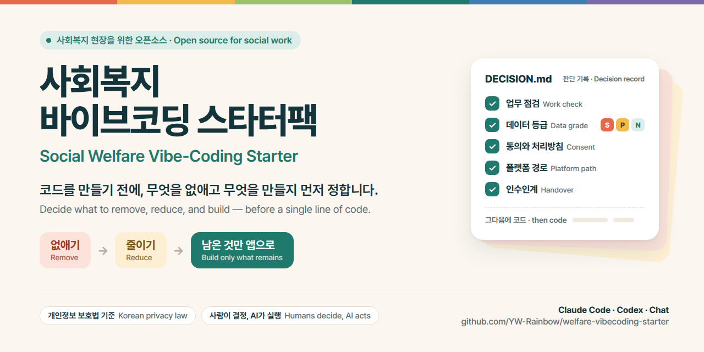

# 사회복지 바이브코딩 스타터팩

> 코드 템플릿이 아니라, 앱을 만들기 전에 필요한 정보와 판단 근거를 정리한 문서 모음입니다.
> 템플릿으로 복사하거나 플러그인으로 설치해 AI와 대화하면, 놓치기 쉬운 것을 AI가 먼저 물어보고 무엇을 어디에 어떻게 만들지 함께 정리합니다.

## 최근 바뀐 것

| 버전 | 바뀐 것 | 이미 만든 앱에서 할 일 |
| :--- | :--- | :--- |
| **1.4**<br>2026.10 | AI로 보내는 기록의 국외이전 근거 정정([`consent-notes.md`](ops/consent-notes.md) 1절): 보관과 AI 처리는 근거가 같아서, 학습에 쓰지 않는 업체에 계약이 있는 사람의 정보를 맡기면 처리방침 공개로 됨. 동의는 해석 다툼을 피하려고 고르는 방법. 동의서 AI 항목은 "안내 또는 동의"로, 명부 필드는 `AI처리_가능`으로. 업체 계약 비교 정정(Anthropic, AWS Bedrock) | AI 전송에 동의를 받고 있다면 그대로 써도 됨. 처리방침 공개로 바꾸려면 처리방침에 AI 사업자와 거부 방법을 적고, 동의서 ⑤와 명부 필드를 바꾸기. Anthropic API로 S등급 기록을 보내고 있다면 계약 다시 확인 |
| **1.3**<br>2026.10 | 근태·급여와 전자결재를 직접 만들 때의 기준([`record-integrity.md`](starter/data/record-integrity.md)): 처음 설계할 때 8개 원칙을 넣고, 승인된 문서는 고치지 않고 취소와 새 기안으로 바꾸며, 외부 감사에게 설명할 수 있는 수준이 목표. 근태·급여는 확정 내역과 급여명세서를 직원 개인 메일로 보내 기관 밖 사본으로 삼음 | 승인된 문서를 고치거나 지우는 기능이 있으면 취소와 새 기안으로 바꾸고, 그 절차를 [`DECISION.md`](starter/templates/DECISION.md)에 적기 |
| **1.2**<br>2026.09 | Aside 같은 에이전트 브라우저로 정부 업무 시스템(희망이음 등)과 기관 앱·시트를 동기화할 때의 주의점([`starter/assess/screen-agent.md`](starter/assess/screen-agent.md)). [`masking.md`](starter/requirements/masking.md)의 AI 전송 제외 대상을 정부 업무 시스템 자료로 정리하고, 한국 안에서만 추론하는 경로(Bedrock 서울 등) 갱신. 웹훅 요건과 접속기록 기준(2026.11.1 시행, [`requirements.md`](starter/requirements/requirements.md)) | 에이전트 브라우저를 쓰면 원본, 운영 기관 약관·위수탁 협약 확인, 사람이 누르는 버튼(저장, 제출, 결재 요청), 작업 로그 위치를 [`DECISION.md`](starter/templates/DECISION.md)에 적기. 웹훅 payload에 개인정보가 없는지 확인. 접속기록 대상과 점검 주기를 내부 관리계획과 맞추기 |

이미 만든 앱은 [`DECISION.md`](starter/templates/DECISION.md)의 "참고한 저장소 주소와 버전"에 적은 번호의 앞 두 자리와 같은 버전부터 보면 됩니다(1.2.1이면 1.2부터). 전체 기록은 [`CHANGELOG.md`](CHANGELOG.md)에 있습니다.

## 어떻게 시작하나

같은 문서를 쓰는 방법이 세 가지입니다. 도구와 상황에 맞게 고르세요. 어느 방법이든 AI가 읽는 판단 기준은 같습니다.

| 어떤 경우인가요? | 이렇게 시작합니다 |
|---|---|
| **Claude Code나 Codex로 새 앱을 만든다** | 이 페이지 위쪽의 **Use this template** 버튼으로 앱 이름의 저장소를 새로 만들고, 클론한 폴더 안에서 도구를 실행해 바로 대화를 시작합니다. 규칙 파일은 도구가 자동으로 읽습니다. 이미 템플릿으로 만든 저장소를 보고 있다면 클론부터 하면 됩니다. |
| **이미 만들던 앱 폴더가 있거나, 앱을 여러 개 만들 계획이다** | 이 저장소를 플러그인으로 한 번 설치해 둡니다. 그러면 어느 폴더에서 대화하든 판단 절차가 시작됩니다. |
| **Claude나 ChatGPT 채팅창만 쓴다** | [`chat-prompt.md`](starter/chat-prompt.md)를 열어 내용 전체를 복사해 첫 메시지로 붙입니다. 링크만 주면 AI가 문서를 다 읽지 못합니다. |

자세한 방법은 아래 [사용방법](#사용방법)에 있습니다. `/init`은 실행하지 않습니다. 규칙 파일이 이미 갖춰져 있어서 `/init`이 만들어 주는 내용은 필요하지 않습니다.

## 왜 만들었나

저는 사회복지 현장에서 오랫동안 스마트워크 교육과 디지털 전환 컨설팅을 해 왔습니다. 2023년 GPT-4가 나온 뒤부터는 AI와 함께 직접 도구를 만들어 왔고 관련 교육도 했습니다. 이 저장소에는 그 시간 동안 기관들과 함께 부딪치며 얻은 노하우와 관점을 담았습니다.

사실 우리는 그동안 손에 맞지 않는 프로그램을 억지로 써 왔습니다. 데이터가 여기저기 흩어져 있어 실적을 계산하거나 통계를 만들 때 근거를 찾지 못해 어려움을 겪었고, 반복 행정에 시간과 에너지를 쏟았습니다. 정부가 의무로 쓰게 하는 프로그램은 좀처럼 바뀌지 않고, 업체에 맡기면 비용이 많이 듭니다. 그 사이에서 현장은 비효율과 무력감을 견뎌 왔습니다.

저는 바이브코딩이 그 자리를 되찾는 일이라고 생각합니다. 우리가 겪는 불편을 해결할 도구를 스스로 고르고, 그 도구를 운영할 규칙과 데이터 보호 장치를 동료들과 함께 정하고, 불편하면 다음 날 바로 고쳐 씁니다. 실무자가 자기 손에 맞는 도구를 직접 만들 수 있게 된 거죠. 저는 이것을 **현장 자율성과 도구 주권의 회복**이라고 생각합니다.

그런데 실제로 해 보면 시간이 많이 드는 것은 코드를 만드는 일이 아닙니다. 코드는 AI가 뚝딱 만듭니다. 개발자는 코딩하기 전에 어느 플랫폼을 쓸지, 데이터를 어디에 두고 누구에게 보여 줄지, 로그인과 백업을 어떻게 할지부터 정합니다. AI가 코드를 만들어도 이 결정은 사람이 해야 합니다.

개발자도 답할 수 없는 질문이 있습니다. 민감정보를 앱에 넣으려면 별도 동의를 받아야 하는지, 그 정보를 꼭 모아야 하는지, 내가 그만두면 이 앱을 누가 맡을지는 법과 규정에 따라 기관이 정해야 합니다. AI는 물으면 답하지만 묻지 않으면 먼저 짚어 주지 않고, 기관이 정할 일을 대신 정하지도 못합니다. 선택지를 모르면 시행착오를 필요 이상으로 되풀이하게 됩니다.

게다가 혼자 테스트용으로 만들어 보는 앱은 기관과 당사자가 실제로 쓰는 앱과 전혀 다릅니다. 바이브코딩을 처음 접하면 신기해서 이것저것 만들어 보게 됩니다. 시험 삼아 만든 앱은 문제가 있어도, 나 혼자 불편하고 내가 책임지면 그만입니다. 업무에 쓰는 앱에는 현실의 개인정보가 쌓입니다. 사회복지 현장이 다루는 정보는 건강과 장애, 상담 내용 같은 민감정보입니다. 그래서 이런 앱은 처음부터 다른 분야보다 엄격한 기준으로 만들어야 합니다.

그동안 우리가 쓴 업무 프로그램은 대부분 다른 사람이 만들어 준 것이었습니다. 희망이음 같은 정부 시스템이나 업체가 만든 프로그램에서는 이런 결정을 만든 쪽이 대신 했습니다. 희망이음에서 이용자의 개인정보를 조회하려면 사유를 적어야 하고, 누가 언제 누구의 정보를 봤는지는 접속기록으로 남습니다. 그런데 이런 기록은 관리 권한이 있는 사람에게만 보이고, 우리가 쓰는 화면에는 나오지 않습니다. 제가 현장 실무자들이 만든 앱을 살펴보면 로그인은 대부분 있었지만 접속기록이나 조회 사유 입력은 빠진 경우가 많았습니다.

AI에게 프로그램 신청 앱을 만들어 달라고 하면 신청서 화면과 명단 화면이 금방 나옵니다. 하지만 사람마다 볼 수 있는 기록을 나누는 권한 설정이나 접속기록, 수정기록, 조회 사유 입력은 우리가 먼저 요청하지 않으면 빠진 채로 완성됩니다. AI는 부탁받은 화면을 먼저 만들기 때문입니다.

어떤 도구로 앱을 만들든 그 앱에 쌓인 개인정보를 보호할 책임은 기관에 있습니다. 로그인이나 백업은 플랫폼이 맡아 주기도 하지만, 접속기록과 동의서, 개인정보를 언제 지웠는지 적는 파기 대장은 어느 플랫폼을 쓰든 기관이 직접 만들고 관리해야 합니다. 플랫폼마다 기관이 할 일은 [요건 매트릭스](starter/workflow.md#요건-매트릭스)에 정리했습니다.

이런 일을 줄이는 가장 확실한 방법은 처음부터 필요한 만큼만 모으는 것입니다. 모으는 정보가 적을수록 새어 나갈 것도 적고, 보관 기간이 끝나 파기할 것도 줄어듭니다. 좋은 뜻으로 만든 앱이 결과적으로 이용자의 정보를 드러내거나 권리를 침해할 수 있습니다. 저는 그 점이 걱정됩니다.

도구는 일하는 방식을 바꿉니다. 2011년 제가 일하던 복지관은 구글앱스를 들였고, 전 직원이 회의자료를 동시에 실시간으로 쓰기 시작했습니다. 그러자 다른 팀의 현안이 따로 설명하지 않아도 공유되었고, 회의 문화도 바뀌었습니다. 조직문화는 바꾸기 어렵다고들 하지만, 이때는 도구 하나가 조직문화를 바꿨습니다. 도구에는 그것을 만든 사람들의 일하는 방식이 담겨 있기 때문입니다.

우리가 만드는 앱도 똑같습니다. 누가 몇 번 빠뜨렸는지 세는 앱을 쓰면 서로를 지켜보는 문화가 생기기 쉽습니다. "대상자 관리"라는 메뉴를 날마다 누르다 보면 사람을 관리할 대상으로 대하기 쉽습니다. 이제는 앱에 어떤 일하는 방식을 담을지 우리가 정합니다. 그래서 앱을 어떤 철학으로 설계하는지가 중요합니다. 판단 기록([`DECISION.md`](starter/templates/DECISION.md)) 맨 앞에 기관의 실천 원칙을 적게 한 것도 이 때문입니다.

스타터팩은 이런 기준을 앱을 만들기 전에 확인하도록 돕는 문서 모음입니다. 코딩을 하기 전에 AI에게 이 문서를 읽게 하면, 놓치기 쉬운 것을 AI가 먼저 물어봅니다. 그렇다고 스타터팩만 있으면 되는 것은 아닙니다. 업무에 쓸 앱을 만들려면 개발 공부를 꾸준히 해야 합니다. 스타터팩에는 그 공부를 시작할 때 필요한 기초지식을 모았습니다. 일반 개발자가 아니라 이 현장에서 앱을 만드는 사람이 알아야 할 것들입니다.

앱을 만드는 것 자체는 목적이 아닙니다. 목적은 반복 행정을 줄여 당사자를 만날 시간을 되찾는 것입니다. 그래서 앱을 만들거나 자동화하기 전에 이 절차가 법령이나 지침에서 요구하는 일인지, 우리 기관의 관행이라 없애도 되는 일인지부터 물어야 합니다. 없애고, 줄이고, 남은 것만 앱으로 만들면 좋겠습니다.

이를 위해 우리가 하는 일이 무엇인지 철저하게 규명하고 객관적으로 분석해야 합니다. 흔히 SOP를 작성한다고 하는데, 이 과정 없이 앱부터 만들기 쉽습니다. 그래서 실제 SOP를 작성하고 그 과정에서 데이터베이스를 설계하는 절차를 넣었습니다.

제가 요즘 가장 크게 느끼는 것은 우리 현장에 최초 기록을 참조하는 구조가 없다는 것입니다. 프로그램 접수는 전화와 종이로 받아 엑셀에 적고, 출석은 인쇄한 출석부에 강사가 표시하고, 담당자가 합계만 엑셀로 옮기고, 팀과 기관이 취합해 시군구에 내면, 시군구는 그것을 다시 모아 위로 올립니다. 단계마다 사람이 옮겨 적고, 중간에 한 번 틀리면 그 이후 작업을 전부 다시 합니다.

모든 결과물은 결국 최초 기록에서 나오는데, 정작 최초 기록을 참조하지 않고 사본을 다시 사본으로 만듭니다. 저는 디지털 전환이 종이를 화면으로 바꾸는 일이 아니라, 기록이 처음 생길 때 제대로 남기고 그 뒤의 모든 작업이 그 기록을 참조하게 만드는 일이라고 생각합니다. 엑셀에 옮겨 적는 것은 디지털이 아니라 옮겨 적기입니다. 이것이 되어야 디지털 전환이 시작되고, AI 전환도 그다음에야 할 수 있습니다. 사람이 꼭 할 일을 먼저 정하고, 나머지 가운데 AI에 맡길 일을 고르고, AI가 한 일은 사람이 확인하고 되돌릴 수 있어야 합니다. 최초 기록을 원본으로 삼는 방법은 [`ssot.md`](starter/data/ssot.md)에, 사람이 할 일과 AI에 맡길 일을 나누는 방법은 [`ai.md`](starter/requirements/ai.md)에 정리했습니다.

정부 업무 시스템(희망이음 등)과도 같은 문제가 있습니다. 시설은 인사, 회계, 후원, 보고, 서비스 이력을 이 시스템에 입력하고, 기관 앱과 시트에도 같은 내용을 적습니다. 이 시스템에는 기관이 쓸 수 있는 API가 없으니 SSoT(단일 원본)를 지킬 수 없고, 두 곳을 손으로 동기화하다 보면 불편하고 누락이 생깁니다. 그래서 요즘은 Aside 같은 에이전트 브라우저에 이 동기화를 맡기려는 분들이 늘고 있습니다. 저는 이 흐름을 막기보다 안전하게 쓰는 법을 함께 정하는 것이 맞다고 생각합니다. 기관 앱·시트를 원본으로 두고, 처음에는 대조만 시키고, 로그인과 저장·제출은 사람이 하는 순서를 [`screen-agent.md`](starter/assess/screen-agent.md)에 정리했습니다.

그런데 막상 기관에서 하려고 하면, 생각보다 저항이 심합니다. 당장 일이 많아지는 것 같기도 하고, 기존에 하던 방식이 마치 잘못된 것처럼 느껴지도록 메시지를 잘못 전하기도 하는 것 같습니다. 저는 우리가 ‘문제를 문제라고 정의하는 것’ 자체를 터부시하고, 그 일에 익숙하지 않기 때문은 아닐까 생각합니다.

사회복지에서는 강점관점이 굉장히 중요합니다. 그런데 이런 관점에 익숙해지다 보니, 조직의 업무나 시스템을 볼 때도 ‘문제’라는 말을 너무 조심하게 되는 경우가 있는 것 같습니다.

“그래도 잘하고 있는 부분이 있는데”, “현장에서는 다 사정이 있는데”, “문제라고 표현하기는 조금 그렇고…” 하다 보면 정작 무엇을 바꿔야 하는지가 흐려지기도 하고요.

그런데 DX·AX나 업무개선을 하려면 결국 지금 무엇이 불편한지, 어디에서 오류나 누락이 생기는지, 왜 같은 일이 반복되는지를 집요하고, 또 아프도록 명확하게 정의해야 합니다. 문제를 선명하게 정의하지 못하면 AI를 붙이든 시스템을 만들든 결국 어렵습니다.

중요한 건, 사람을 문제로 보는 것과 시스템의 문제를 찾는 것이 전혀 다르다는 점입니다.

예를 들어
“담당자가 자꾸 누락한다”라고 하면 개인의 문제가 되지만,
“현재 업무가 담당자의 기억과 경험에 의존하고 있고 누락을 막아주는 절차가 없다”라고 보면 시스템의 문제가 됩니다.

후자의 방식이 오히려 사람을 탓하지 않으면서도 조직을 바꿀 수 있는 접근이 아닐까 싶습니다.

그래서 사람에게는 강점관점, 시스템에는 문제해결관점으로 구분하면 좋을 것 같아요.
당사자나 직원을 문제로 규정하지는 않되, 당사자와 직원이 불편을 겪게 만드는 절차와 구조의 문제는 오히려 더 정확하게 찾아야 하지 않을까 싶습니다.

그리고 조직 안에서 만들 수 있는지 묻기 전에 만들어도 되는지 물어보면 좋겠습니다. 근태를 정확하고 편리하게 관리하려고 지문등록 출근앱을 만들 수 있다고 해서, 만들어도 된다는 뜻은 아닙니다. 목적이 옳다고 모든 수단이 정당해지는 것은 아니니까요.

직원의 근태나 위치, 이용자의 상담 내용을 기록하는 앱이라면 만들기 전에 따져 볼 다섯 가지 질문을 [`ethics.md`](starter/assess/ethics.md)에 모았습니다. 목적, 필요성, 대체 수단, 부담, 당사자 관점입니다. 어떤 위험과 부담이 있는지 알고 기관이 결정하기 위한 것입니다.

모든 문서는 개발 지식이 없는 독자를 기준으로 썼고, 낯선 용어는 [`glossary.md`](starter/glossary.md)에 정리했습니다. AI도 이 문서를 바탕으로 작업할 때는 용어를 설명하면서 작업하도록 했습니다. 처음부터 다 알고 시작하는 사람은 없습니다. 저도 계속 배우면서 스타터팩을 고쳐 가겠습니다.

## 사용방법

세 방법 모두 처음부터 요구사항을 완벽하게 정리하지 않아도 됩니다. 만들고 싶은 앱의 목적과 지금 업무 방식을 설명하면 AI가 [`workflow.md`](starter/workflow.md)의 판단 기준으로 그 업무가 꼭 필요한지 확인하고, 이미 알 수 있는 내용은 추론하며 필요한 정보만 물어본 뒤 적합한 경로를 추천합니다. 결정은 기관이 하고, 그 근거와 결론은 판단 기록(`DECISION.md`)에 적어 둡니다.

판정(업무 점검, 데이터 등급, 동의 판단)은 Opus 같은 상위 모델로, 가능하면 이 저장소를 연 에이전트형 도구에서 하세요. 세 사례로 비교해 보니 모델 사이의 차이는 지시를 얼마나 따르는지보다, 다른 문서에 있는 사실을 찾아 읽는지와 모르는 것을 지어내지 않는지에서 났습니다. 가벼운 모델은 등급을 잘못 매기거나 법 근거와 기관의 결정을 지어낸 경우가 있었으므로, 가벼운 모델로 판정했다면 P·S등급 앱의 `DECISION.md`는 상위 모델에게 한 번 더 확인받으세요. 운영하고 있는 앱에 반영하는 일과 DB를 바꾸는 일의 확인 규칙은 어느 모델을 쓰든 끄지 마세요.

> "우리 기관 프로그램일지 앱을 만들려고 해. 사진도 회기당 2~3장 올라가."

처음 써 본다면 업무에 쓸 앱보다 먼저 개인정보가 없는 작은 앱을 하나 만들어 보세요. 안내 페이지, 계산기, 물품 재고, 익명 만족도 집계 같은 N등급 앱은 판정이 몇 분에 끝나고, 안내 페이지나 계산기처럼 저장하지 않는 앱은 서버도 필요 없습니다. 도구가 어떻게 움직이는지 익힌 뒤 업무에 쓸 앱을 판정하면 질문이 길어도 흐름을 놓치지 않습니다.

### 템플릿으로 시작하기: 앱마다 새 저장소를 만든다

1. 이 페이지 위쪽의 **Use this template** 버튼을 누르고 앱 이름으로 저장소를 만듭니다. 문서만 복사되고 이 저장소의 이력은 따라오지 않습니다.
2. 만든 저장소를 컴퓨터로 클론하고, **그 폴더 안에서** Claude Code나 Codex를 실행합니다. Claude Code는 [`CLAUDE.md`](CLAUDE.md)를, Codex는 [`AGENTS.md`](AGENTS.md)를 자동으로 읽고 나머지 문서로 이어집니다.
3. 판정이 끝나면 AI가 판정 결과와 기관의 결정을 `DECISION.md`에 적고, 선택한 개발 규칙을 `CLAUDE.md`와 `AGENTS.md`에 연결합니다. 앱은 같은 저장소의 `app/` 같은 폴더에서 만듭니다. `starter/`와 `ops/`는 판단 근거와 운영 자료이므로 지우지 않습니다. 이 README는 [`starter/templates/APP-README.md`](starter/templates/APP-README.md)를 바탕으로 앱 소개로 바뀌고, 스타터 안내는 원본 저장소 링크로 남습니다. 운영하고 있는 앱(실제 직원과 이용자가 쓰는 앱)에 반영하거나 운영 DB를 바꿀 때는 AI가 바뀌는 내용과 되돌릴 방법을 먼저 보고하고 실행 허락을 묻습니다. 보고를 읽고 허락하는 것이 사람의 결정입니다.
4. 다음 앱도 템플릿 버튼을 다시 눌러 새 저장소에서 시작합니다. 한 저장소에 앱을 두 개 만들지 않습니다. 앱을 자주 만든다면 아래 플러그인 방식이 편합니다.

### 플러그인으로 시작하기: 한 번 설치하고 어느 폴더에서나 쓴다

이미 앱 폴더가 있거나 여러 앱을 만들 계획이라면 이 저장소를 플러그인으로 설치합니다. 한 번 설치하면 어느 폴더에서든 "복지관 앱을 만들고 싶어" 같은 말에 판단 절차가 자동으로 시작됩니다. 그렇지 않으면 "사회복지 앱 판단 절차로 시작해 줘"라고 요청합니다. 스킬은 두 개입니다. 앱 아이디어에서 시작하는 판정 절차와, HWP 양식 파일에서 시작하는 양식→앱 절차([`form-to-app.md`](starter/assess/form-to-app.md))입니다.

Claude Code에서는 두 줄입니다.

```
/plugin marketplace add YW-Rainbow/welfare-vibecoding-starter
/plugin install welfare-vibecoding-starter@welfare-vibecoding-starter
```

Codex에서는 터미널에서 마켓플레이스를 추가한 뒤 플러그인 화면(`/plugins`)에서 설치하고, 새 세션을 시작해야 스킬을 쓸 수 있습니다.

```
codex plugin marketplace add YW-Rainbow/welfare-vibecoding-starter
codex /plugins
```

판정이 끝나면 AI가 `starter/`, `ops/`, `AGENTS.md`, `CLAUDE.md`를 앱 폴더로 복사해 템플릿으로 만든 저장소와 같은 구조를 갖추고, `DECISION.md`를 채운 뒤 선택한 규칙을 연결합니다. 이미 있던 앱 코드는 옮기지 않고 그대로 둡니다. 앱마다 채우는 것은 [`handover.md`](ops/handover.md)와 [`destruction-log.md`](ops/destruction-log.md)입니다. 동의서와 처리방침 파일은 참고 양식이므로 앱마다 고쳐 쓰지 않고, 기관이 실제로 쓰는 동의서와 처리방침은 기관에 하나만 두고 그 위치를 `DECISION.md`에 적습니다. 판단 근거가 앱 폴더에 남아 후임자가 읽을 수 있습니다. 다음 앱은 새 폴더에서 시작합니다.

### 채팅만 쓴다면

Claude나 ChatGPT의 일반 채팅은 저장소 주소를 주어도 README 한 페이지만 요약해서 읽고, `CLAUDE.md` 같은 규칙 파일은 아예 읽지 않습니다. 그래서 링크가 아니라 본문을 붙여야 합니다. [`chat-prompt.md`](starter/chat-prompt.md)를 열어 내용 전체를 복사해 첫 메시지로 붙이고, 이어서 만들고 싶은 앱을 설명하세요. 이 파일에는 판단 절차 본문이 그대로 들어 있습니다. 판정 뒤 실제 개발로 넘어갈 때는 위의 템플릿 방식을 권합니다.

### 양식 전체를 정리하고 싶다면

앱 하나가 아니라 기관의 양식과 업무 전체를 정리하고 싶다면 [`form-audit.md`](starter/assess/form-audit.md)에서 시작하세요. 양식을 하나씩 따로 보면 모두 필요해 보이므로, 기관에서 쓰는 양식을 한곳에 모아 같은 기준으로 살펴봐야 합니다. 양식마다 근거가 무엇인지, 실제로 누가 읽는지, 법정서식인지, 같은 데이터를 반복해 적고 집계하는지를 차례로 확인하면 없앨 양식, 그대로 둘 양식, 앱으로 만들 양식을 구분할 수 있습니다. 불필요한 양식을 없애거나 합치는 것이 첫 번째 성과이고, 앱으로 전환하기로 한 양식만 [`workflow.md`](starter/workflow.md)의 판정 절차로 넘어갑니다.

앱을 여러 개 만들 계획이거나 담당자마다 별도의 파일로 이용자 정보를 관리하고 있다면 [`ssot.md`](starter/data/ssot.md)를 먼저 확인하세요. 이용자 명부 하나를 원본으로 정하지 않은 채 앱만 늘리면 같은 어르신이 파일마다 서로 다른 이름으로 기록되고, 나중에는 담당자가 자료를 일일이 대조해야 합니다. 이용자는 명부에서만 등록하고, 각 앱의 기록은 이용자 이름이 아니라 이용자 ID로 연결하는 것이 핵심입니다.

## 기본 흐름

```
없애거나 줄일 업무 찾기
        ↓
사람과 조직에 미칠 영향 확인
        ↓
원본 데이터와 기록 기준 정하기
        ↓
사용자·출력·보호·운영 요건 정하기
        ↓
플랫폼과 개발 규칙 선택
        ↓
같은 저장소의 app/ 폴더에서 개발
        ↓
스테이징에서 확인하고 운영하고 있는 앱에 반영(사람이 결정하고 AI가 실행)
```

## 저장소 구성

루트에는 AI 도구가 읽는 규칙 파일, 여러분이 만들 파일, 버전 기록과 플러그인 설정을 두고, 스타터의 참고 자료는 [`starter/`](starter/) 폴더에 모았습니다. 템플릿으로 복사한 뒤에는 `starter/`는 읽기만 하고, 나머지는 앱에 맞게 채우고 만듭니다.

| 위치 | 내용 | 누가 쓰나 |
|---|---|---|
| [`AGENTS.md`](AGENTS.md), [`CLAUDE.md`](CLAUDE.md) | AI 도구가 폴더 안에서 자동으로 읽는 작업 규칙 | Codex, Claude Code |
| [`skills/`](skills/) | 플러그인으로 설치할 때 사용하는 스킬 두 개. 판정 절차와 HWP 양식→앱 절차. 규격상 위치가 고정되어 있습니다 | 도구 |
| [`starter/workflow.md`](starter/workflow.md) | 판단 절차 본문. 어떤 방법으로 시작해도 AI는 결국 이 문서를 읽습니다 | AI |
| [`starter/chat-prompt.md`](starter/chat-prompt.md) | 채팅창에 붙이는 판단 안내 | 채팅 사용자 |
| [`starter/assess/`](starter/assess/) | 양식 점검, HWP 양식→앱 절차, 윤리 검토, 기관 공용 AI 에이전트(Slack 봇 등), 에이전트 브라우저로 정부 업무 시스템 동기화 | AI, 실무자 |
| [`starter/data/`](starter/data/) | SSoT(단일 원본), 자체 개발 전자결재·근태·회계 기록의 무결성([`record-integrity.md`](starter/data/record-integrity.md)), 데이터 관리 다섯 단계 | AI, 실무자 |
| [`starter/requirements/`](starter/requirements/) | 공통 요구사항 12개(웹훅 포함), 당사자 화면 설계·접근성, 인쇄·엑셀, 마스킹, HWP, AI 기능 | AI, 실무자 |
| [`starter/glossary.md`](starter/glossary.md), [`starter/platform-facts.md`](starter/platform-facts.md), [`starter/resources.md`](starter/resources.md) | 용어사전, 바뀌는 플랫폼 정보, 함께 볼 자료 | 실무자 |
| [`starter/rules/`](starter/rules/) | 플랫폼별 개발 규칙과 에이전트 안전 경계. 판정 뒤 `CLAUDE.md`와 `AGENTS.md`에 연결합니다 | AI |
| [`starter/templates/`](starter/templates/) | `DECISION.md`와 앱 README의 빈 양식 | AI가 복사 |
| [`ops/`](ops/) | 앱마다 채우는 인수인계·파기 대장과, 동의서·처리방침 참고 양식. 실제 동의서와 처리방침은 기관에 하나만 두고 위치를 `DECISION.md`에 적습니다 | 기관 담당자 |
| `DECISION.md` | 판정 뒤 생기는 판단 기록 | AI, 실무자 |
| [`CHANGELOG.md`](CHANGELOG.md) | 버전 기록. 판단 기준이 바뀐 것을 버전별로 적고, 최근 3개 버전은 이 README 맨 위에도 있습니다 | 실무자 |
| `app/` | 판정 뒤 앱 코드가 들어가는 자리. 처음에는 없습니다 | AI, 실무자 |
| [`plugin.json`](plugin.json), [`.claude-plugin/`](.claude-plugin/), [`.codex-plugin/`](.codex-plugin/), [`.agents/`](.agents/) | 플러그인 매니페스트. 템플릿으로 복사한 저장소에서는 건드리지 않아도 됩니다 | 도구 |

## 함께 보면 좋은 자료

현장에서 이미 만들어 쓰고 있는 도구와 앱, 그리고 이 저장소의 바탕이 된 글입니다. 이 저장소는 아래 분들의 작업 덕분에 만들 수 있었습니다. 감사드립니다. 자료마다 자세한 소개와 이어지는 문서는 [`resources.md`](starter/resources.md)에 적었습니다.

**스타터 템플릿**
- [apps-script-vibe-starter](https://github.com/YW-Rainbow/apps-script-vibe-starter): 신용우. 경로 C(GAS+시트)용. clasp 설정과 에이전트 규칙이 갖춰져 있습니다. 별도 저장소로 클론하지 않고 내용을 앱 저장소의 `app/`에 복사해 시작합니다.

**만들 때 쓰는 도구**
- [urimal-for-socialworker](https://github.com/dreamworker0/urimal-for-socialworker): 김종원. 계획서와 보고서를 자연스러운 우리말로 다듬는 Claude Code 스킬
- [EASYREAD](https://github.com/SWJoong/EASYREAD): 최중호. 복잡한 한국어를 쉬운 정보(Easy-Read)로 바꾸는 MCP 서버
- [rhwp](https://github.com/edwardkim/rhwp): Edward Kim(edwardkim). 브라우저에서 HWP를 읽고 누름틀을 채워 저장하는 오픈소스 엔진. MCP로 AI가 HWP 양식을 직접 읽고, [크롬 확장](https://chromewebstore.google.com/detail/pgakpjflombjmehnebnbpnalhegaanag)으로 HWP를 브라우저에서 바로 엽니다
- [rhwp-studio](https://github.com/dreamworker0/rhwp-studio): 김종원. Google Drive의 HWP를 열어 편집하고 저장하는 웹 편집기

**현장에서 만든 앱**
- [vehicle-drive-log](https://github.com/dreamworker0/vehicle-drive-log): 김종원. 여러 기관이 함께 쓰는 차량 운행일지 웹앱, 실제 운영 중
- [Family-tree](https://github.com/dreamworker0/Family-tree): 김종원. 서버 없이 브라우저에서만 동작하는 대화형 가계도(Genogram) 웹앱
- [SW_EDMS](https://github.com/SWJoong/SW_EDMS): 최중호. 기록 무결성을 보강한 전자결재 학습용 샘플

**이 저장소의 절차로 만든 앱**
- 아직 없습니다. 이 절차로 앱을 만들었다면 [기여 안내](.github/CONTRIBUTING.md)를 보고 알려 주세요. 판단 기록(`DECISION.md`)과 함께 여기에 연결합니다.

**읽을거리**
- [사회복지사가 바이브 코딩까지 해요](https://socialwork-vibecoding.jijun74.workers.dev/): 전재일. 온라인 책
- [모두를 위한 스마트워크](https://wish.welfare.seoul.kr/swflmsfront/coworker/ksdetail.do?pno=10026&userno=58550): 신용우. 이 저장소를 소개하는 「바이브코딩을 시작하기 전에」 연재가 있는 곳입니다. 앞선 데이터 설계 방법론과 온톨로지 연재는 [`levels.md`](starter/data/levels.md) 4단계의 바탕
- [기록에서 데이터로, 데이터에서 삶으로](https://www.dtsw.org/journal/5668173483343872): 김진래. 흩어진 기록을 원장 하나로 모은 뒤 AI를 연계한 2년의 실천 보고. [`ai.md`](starter/requirements/ai.md)의 바탕
- [AI 시대, 사회복지 현장이 바꿀 것, 버릴 것, 지킬 것](https://www.welfare.net/communication/promotion/card-news-detail?searchType=all&searchValue=%EC%8B%A0%EC%9A%A9%EC%9A%B0&id=888716): 신용우. 칼럼(한국사회복지사협회 카드뉴스)과 실천지혜 연작. [`ai.md`](starter/requirements/ai.md)의 바탕
- [사회복지 현장 AI·바이브코딩 안전사용 가이드](https://docs.google.com/document/d/1at2PqpW1kG3zEh5XIDaTLMC2ozN0Ar1Gf9YgvSjmnTc/edit?usp=sharing): 신용우. 기관용 AI 사용 가이드라인·동의서·처리방침 제작 매뉴얼. [`ops/`](ops/)의 동의서 양식과 같은 기준
- [vibecoding-pub의 사용자 권한 프로토콜](https://github.com/elbumlee/vibecoding-pub/blob/main/references/user-authority.md): 이경태. 사용자를 목적과 범위를 정하는 결정권자로 보는 관점. [`agentic.md`](starter/rules/agentic.md)의 바탕
- [AI는 만들고, 리더는 판단한다](https://thornjsh.github.io/AI%20%EB%A6%AC%EB%8D%94%EC%8B%AD%202026-0819.pdf): 정수홍. 사회복지시설의 DX·AX를 이끄는 리더십. 없앨 업무를 결정하고 책임의 경계를 정하는 기관장의 몫

## 알아둘 것

이 저장소의 문서는 법률 자문이 아닌 실무 참고 자료입니다. 판정 절차는 2026년 9월에 지금 구조로 정리되었고, 이 절차로 끝까지 만든 앱 사례는 아직 모으는 중입니다. 민감정보를 다루는 시스템은 도입하기 전에 개인정보 전문가의 검토를 받으세요. 플랫폼의 가격, 한도, 리전, AI 사업자 계약 정보는 각 문서 머리말의 기준일(2026년 8~9월)을 따르며 이후 달라질 수 있습니다. 문서에는 CC BY 4.0을, 코드와 코드 예시에는 MIT 라이선스를 적용합니다. 자세한 범위는 [`LICENSE.md`](LICENSE.md)를 확인하세요.
